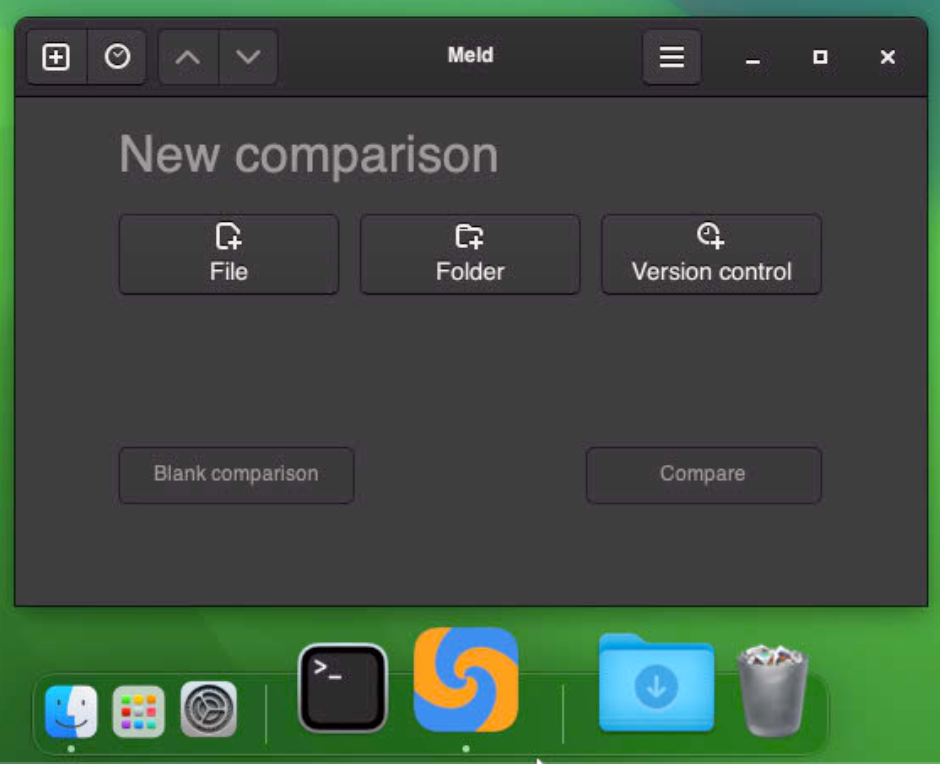

# Meld for macOS




This project builds a macOS app for [Meld](https://meld.app). The app is standalone, relocatable and supports macOS High Sierra up to macOS Sonoma.

## usage

### in the terminal

You probably want to just type `meld` to open it. There are different ways to set that up.

Add an alias to e.g. `~/.zshrc`:

```bash
# This command assumes you are using the ZSH shell.
echo "alias meld='/Applications/Meld.app/Contents/MacOS/Meld'" >> ~/.zshrc
```

Or create a symlink in a folder in your `PATH`, e.g. in `/usr/local/bin`:

```bash
# Ensure that /usr/local/bin exists and that you have write permission
# before running this command.
ln -s /Applications/Meld.app/Contents/MacOS/Meld /usr/local/bin/meld
```

### as difftool

```bash
git config --global diff.tool meld
git config --global difftool.prompt false
git config --global difftool.meld.cmd "/Applications/Meld.app/Contents/MacOS/Meld \$LOCAL \$REMOTE"
```

## download

Downloads are available in the [Releases](https://gitlab.com/dehesselle/meld_macos/-/releases) section.

If you're feeling adventurous you can also try a development snapshot directly from a CI [pipeline](https://gitlab.com/dehesselle/meld_macos/-/pipelines).

## license

This work is licensed under [GPL-2.0-or-later](LICENSE).  
Meld is licensed under [GPL-2.0-or-later](https://gitlab.gnome.org/GNOME/meld/-/blob/main/COPYING?ref_type=heads).

### additional credits

Built using other people's work:

- [gtk-osx](https://gitlab.gnome.org/GNOME/gtk-osx) licensed under GPL-2.0-or-later.
